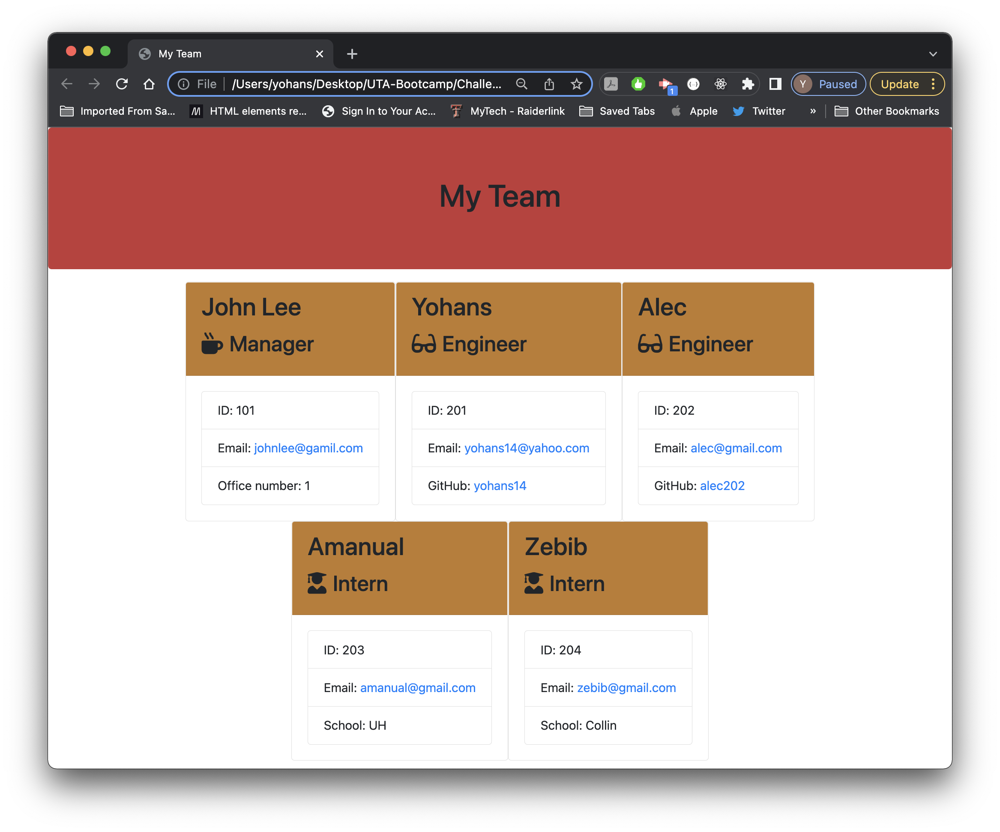
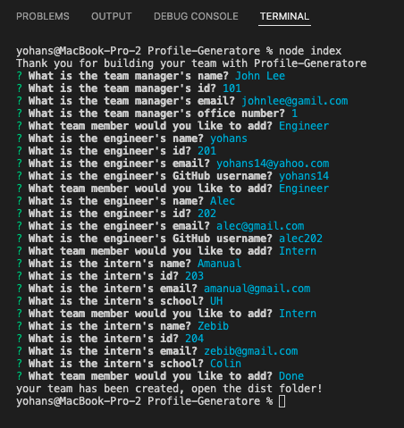

# Profile Generatore

## Description

This is a command-line application that accepts user input to generate a webpage to display a team's basic info so teams can have a quick access to all teams emails, gitHubs profiles. 

## Table of Contents

- [Technologies](#technologies)
- [Installation](#installation)
- [Usage](#usage)
- [Snapshot](#snapshot)
- [License](#license)
- [Tests](#tests)
- [License](#license)
- [Questions](#questions)

## Technologies

The following technologies are used to build this application

- express.js
- node
- inquirer

## Installation

Instructions for Installation:
this a public repo that can be clone to local machine by following the gitHub link, and install Node.js to your machine then from your command line npm i to install the following npm dependancies

    {
    "inquirer": "^8.2.2"
    "jest": "^27.5.1"
    }

## Usage

After installation applicaton can be used to create team profile.

## Snapshot

[Video]("")

## License

The project is licensed under MIT.

[More Info](https://choosealicense.com/licenses/)

## Contributing

If you like to contribut for this project please follow The Contributor Convenant guidelines.

## Tests

## Questions

Please don't hesitate to reach out to us if you have any questions.

Yohans Getaneh

GitHub: https://github.com/yohans14/Profile-Generatore

Email: yohans14@yahoo.com
